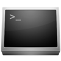

# ConsoleFx

[](https://ci.appveyor.com/project/JeevanJames/consolefx)
[](https://ci.appveyor.com/project/JeevanJames/consolefx/build/tests)
[](https://codecov.io/gh/JeevanJames/ConsoleFx)
[](CODE_OF_CONDUCT.md)

ConsoleFx is a suite of .NET libraries for building command-line (CLI) applications.

## Build console apps with command line arguments
The following code simulates the following made-up console app:

`COPY <source file> [<destination dir>] [--overwrite | o] [--create-dir | c]`

```cs
public class Program : ConsoleProgram
{
    [Argument, ArgumentHelp("source file", "File to copy")]
    [ValidateFile(ShouldExist = true)]
    public string SourceFile { get; set; }
    
    [Argument(Optional = true)]
    [ArgumentHelp("destination dir", "Directory to copy the file")]
    [ValidateDirectory]
    public string DestinationDir { get; set; } = ".";
    
    [Flag("overwrite", "o")]
    [FlagHelp("Specify to allow overwriting the file if it already exists")]
    public bool OverwriteExistingFile { get; set; }
    
    [Flag("create-dir", "c")]
    [FlagHelp("Specify to create the destination directory if it does not exist")]
    public bool CreateDirIfMissing { get; set; }
    
    protected int HandleCommand()
    {
        Console.WriteLine($"You want to copy {SourceFile} to {DestinationDir}");
        Console.WriteLine($"Overwrite file if it exists: {OverwriteExistingFile}");
        Console.WriteLine($"Create destination directory if it does not exist: {CreateDirIfMissing}");
        return 0;
    }
    
    public static async Task<int> Main(string[] args)
    {
        var program = new Program();
        return await program.RunAsync(args);
    }
}
```

## Packages
ConsoleFx consists of the following NuGet packages. Development packages from continuous integration builds are available on [MyGet](https://myget.org/gallery/consolefx).

Package | Description | Dev Build
--------|-------------|----------
`ConsoleFx.CmdLine.Program` | Write command line programs with sophisticated argument parsing, including error handling, automatic help generation and rich validation support. Supports both Unix and Windows-style arguments. | [](https://www.myget.org/feed/consolefx/package/nuget/ConsoleFx.CmdLine.Program)
`ConsoleFx.CmdLine.Parser` | Standalone argument parser that is used by `ConsoleFx.CmdLine.Program`. Can be used in non-console program such as Windows Forms, WPF, REPL, etc. to parse command line arguments in a similar fashion. | [](https://www.myget.org/feed/consolefx/package/nuget/ConsoleFx.CmdLine.Parser)
`ConsoleFx.ConsoleExtensions` | Extended console capabilities like color output, prompts, inputting secrets, outputting indented text, progress bars, etc. | [](https://www.myget.org/feed/consolefx/package/nuget/ConsoleFx.ConsoleExtensions)
`ConsoleFx.Prompter` | Rich interactive framework for getting inputs from users. Inspired by the [Inquirer.js](https://github.com/SBoudrias/Inquirer.js) framework for JavaScript. | [](https://www.myget.org/feed/consolefx/package/nuget/ConsoleFx.Prompter)

### Metapackage
ConsoleFx includes a metapackage that contains all the major packages that would typically needed to build a complex console application.

[](https://www.nuget.org/packages/ConsoleFx/) [](https://www.nuget.org/packages/ConsoleFx/) [](https://www.myget.org/feed/consolefx/package/nuget/ConsoleFx)

### Under development
The following packages are under development and expected in a future release.

Package | Description | Expected Version
--------|-------------|:---------------:
`ConsoleFx.Art` | Output ASCII art in different styles. | 2.1
`ConsoleFx.UI` | Dynamic creation of Windows Forms and WPF UI to visually input command-line arguments. | TBD
